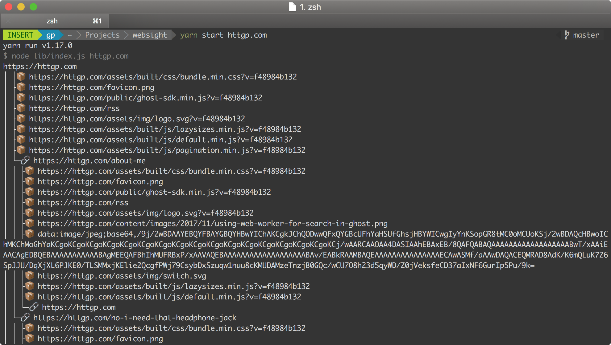

# websight

 [](https://codeclimate.com/github/paambaati/websight/test_coverage) [](https://codeclimate.com/github/paambaati/websight/maintainability) [](LICENSE)


A simple crawler that fetches all pages in a given website and prints the links between them.



<small> 📣 Note that this project was purpose-built for a coding challenge (see [problem statement](PROBLEM-STATEMENT.md)) and is not meant for production use (unless you aren't [web scale](http://www.mongodb-is-web-scale.com/) yet).</small>

### 🛠️ Setup

Before you run this app, make sure you have [Node.js](https://nodejs.org/en/) installed. [`yarn`](https://yarnpkg.com/lang/en/docs/install) is recommended, but can be used interchangeably with `npm`. If you'd prefer running everything inside a Docker container, see the [Docker setup](#docker-setup) section.

```bash
git clone https://github.com/paambaati/websight
cd websight
yarn install && yarn build
```

#### 👩🏻‍💻 Usage
```bash
yarn start <website>
```

#### 🧪 Tests & Coverage
```bash
yarn run coverage
```

### 🐳 Docker Setup

```bash
docker build -t websight .
docker run -ti websight <website>
```
### 📦 Executable Binary

```bash
yarn bundle && yarn binary
```

This produces standalone executable binaries for both Linux and macOS.

## 🧩 Design

```
                                            +---------------------+                        
                                            |   Link Extractor    |                        
                                            | +-----------------+ |                        
                                            | |                 | |                        
                                            | |   URL Resolver  | |                        
                                            | |                 | |                        
                                            | +-----------------+ |                        
                    +-----------------+     | +-----------------+ |     +-----------------+
                    |                 |     | |                 | |     |                 |
                    |     Crawler     +---->+ |     Fetcher     | +---->+     Sitemap     |
                    |                 |     | |                 | |     |                 |
                    +-----------------+     | +-----------------+ |     +-----------------+
                                            | +-----------------+ |                        
                                            | |                 | |                        
                                            | |     Parser      | |                        
                                            | |                 | |                        
                                            | +-----------------+ |                        
                                            +---------------------+                        
```

The `Crawler` class runs a fast non-deterministic fetch of all pages (via `LinkExtractor`) & the URLs in them recursively and saves them in `Sitemap`. When crawling is complete<sup id="a1">[[1]](#f1)</sup>, the sitemap is printed as a ASCII tree.

The `LinkExtractor` class is a thin orchestrating wrapper around 3 core components —

1. `URLResolver` includes logic for resolving relative URLs and normalizing them. It also includes utility methods for filtering out external URLs.
2. `Fetcher` takes a URL, fetches it and returns the response as a [`Stream`](https://nodejs.org/api/stream.html#stream_stream). This is better because streams can be read in small buffered chunks, avoiding holding very large HTMLs in memory.
3. `Parser` parses the HTML stream (returned by `Fetcher`) in chunks and emits the `link` event on each page URL and the `asset` event on each static asset found in the HTML.

<hr/>

<b id="f1"><sup>1</sup></b> `Crawler.crawl()` is an `async` function that _never resolves_ because it is technically impossible to detect when we've finished crawling. In most runtimes, we'd have to implement some kind of idle polling to detect completion; however, in Node.js, as soon as the event loop has no more tasks to execute, the main process will run to completion. This is why we finally print the sitemap in the [`Process.beforeExit`](https://nodejs.org/api/process.html#process_event_beforeexit) event. [↩](#a1)

## 🏎 Optimizations

1. Streams all the way down.

    The key workloads in this system are HTTP fetches (I/O-bound) and HTML parses (CPU-bound), and either can be time-consuming and/or high on memory usage. To better parallelize the crawls and use as little memory as possible, [`got` library's streaming API](https://www.npmjs.com/package/got#streams) and the _very_ fast [`htmlparser2`](https://github.com/fb55/htmlparser2#performance) have been used.

2. Keep-Alive connections.

    The `Fetcher` class uses a global [`keepAlive`](https://nodejs.org/api/http.html#http_new_agent_options) agent to reuse sockets as we're only crawling a single domain. This helps avoid re-establishing TCP connections for each request.

## ⚡️ Limitations

When ramping up for scale, this design exposes a few of its limitations —

1. No rate-limiting.

    Most modern and large websites have some sort of throttling set up to block bots. A production-grade crawler should implement _some_ [politeness policy](https://en.wikipedia.org/wiki/Web_crawler#Politeness_policy) to make sure it doesn't inadverdently bring down a website, and so it doesn't run into permanent bans & `429` error responses.

2. In-memory state management.

    `Sitemap().sitemap` is an unbound `Map`, and can quickly grow and possibly cause the runtime to run out of memory & crash when crawling very large websites. In a production-grade crawler, there should an external scheduler that holds URLs to crawl next.
